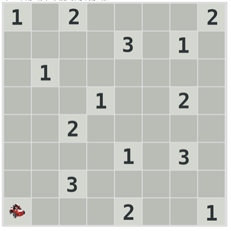
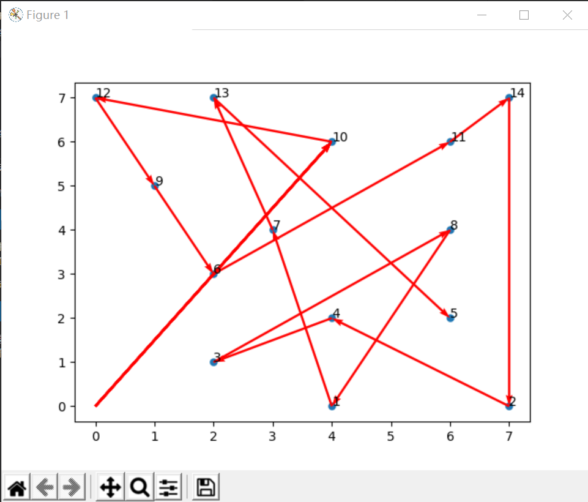
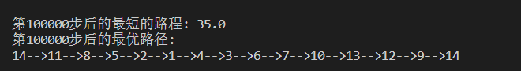
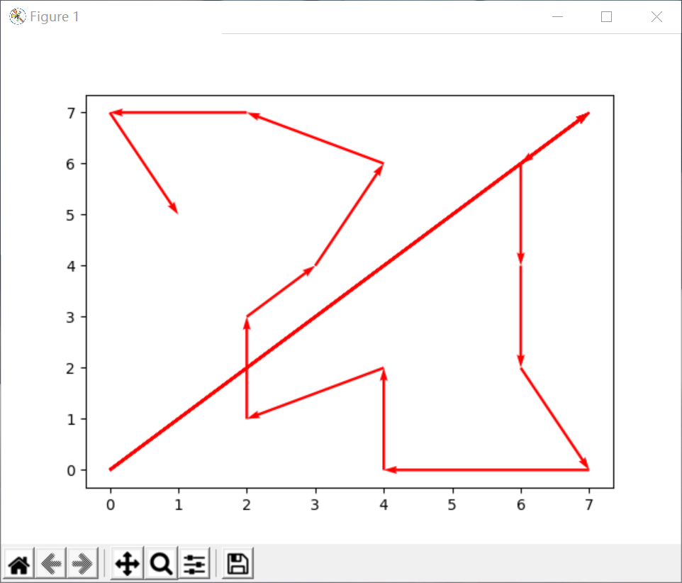
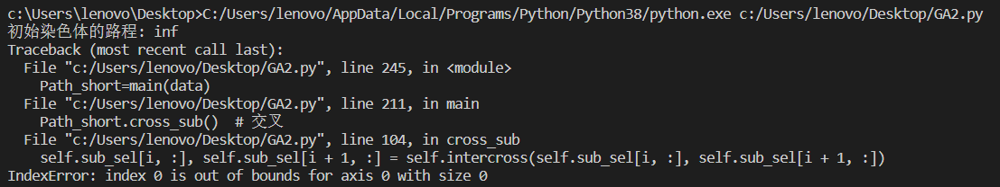
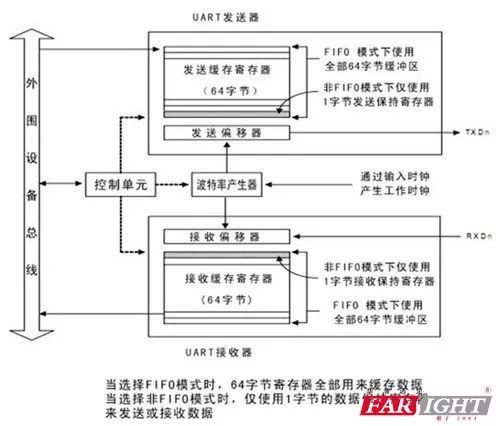

# RoboMaster 2022“疆来计划”活动笔试题目（夏）
## 算法方向：
注：笔试题目做答使用DevC++，VScode并使用插件`python` ，` Better Markdown & Latex Shortcuts` ，`Markdown Preview Enhanced`完成。使用ProcessOn画图，Ubuntu系统为20.04，为虚拟机。

代码和文件同步在仓库https://github.com/StudyingLover/2020SummerCamp_WrittenTest

如果存在单行代码过长不能查看的问题可以直接看仓库的代码
### 问题 2.1
*机器人在 8x8 的栅格地图中需要完成遍历所有带有数字格子的任务，机器人起始位置位于栅格地图的左下角，机器人只能上下左右移动，不能对角线移动。




（1）若机器人速度一直不变，且为 1 个格子/秒（不考虑转向的时间），那么怎样规划机器人的移动才能使得遍历所有数字格子的总时间最短？

（2）若机器人的初速度为 1 个格子/秒，移动到带有数字的格子后，速度会变为该格子显示数字各格子/秒（同样不考虑转向的时间），那么怎样规划机器人的移动才能使得遍历所有数字格子的总时间最短？例如，移动到数字 3 的格子后，速度会变为 3 个格子/秒，此时移动 2 个格子就能到达下一个数字为 2 的格子时，共花费 2/3 秒，然后速度变为 2 个格子/秒。*

分析如下：

该题目为RoboMaster2018高中生夏令营简历原题

**我们约定**：
在该地图建立平面直角坐标系，以出发点格子中心为原点（0，0），以水平向右为x轴，水平向上为y轴，每两相邻格子中心点距离为1。

我认为这道题本质上是一个TSP问题，因此可以将14个格子抽象为14座城市
每个城市都有一个坐标与之对应，即

$
data_n = (x_n,y_n)
$
起点坐标为$(x_0,y_0)$

但是和TSP问题有两点不同：
1. TSP问题中旅行商在两个城市间是“直来直往”的，我们可以写出两个城市间的路程：
   
$
distance = \sum_{i=1}^{n-1} \sqrt{(x_{i+1}-x_i)^2+(y_{i+1}-y_i)^2}\\
or\\
distance = \sum_{i=1}^{n-1} (x_{i+1}-x_i)^2+(y_{i+1}-y_i)^2
$

但是这里题目中已经规定`机器人只能上下左右移动，不能对角线移动`,因此我们只能将距离写作：

$
distance = \sum_{i=1}^{n-1} \lvert x_{i+1}-x_i \rvert+\lvert y_{i+1}-y_i \rvert
$

2. TSP问题要求旅行商从一点出发最终回到出发点，我们可以写出旅行商走过的路程：
   
$
distance = \sum_{i=1}^{n-1} \sqrt{(x_{i+1}-x_i)^2+(y_{i+1}-y_i)^2}+\sqrt{(x_{i+1}-x_1)^2+(y_{i+1}-y_1)^2}\\
or\\
distance = \sum_{i=1}^{n-1} (x_{i+1}-x_i)^2+(y_{i+1}-y_i)+{(x_{i+1}-x_1)^2+(y_{i+1}-y_1)^2}\\
$

但是这道题不需要回到原点，有规定了一个出发点，我们可以把总路程写作

$
distance = \sum_{i=1}^{n-1} \lvert x_{i+1}-x_i \rvert+\lvert y_{i+1}-y_i \rvert+\lvert x_{0}-x_1 \rvert+\lvert y_{0}-y_1 \rvert\\
$

TSP问题的求解有多种方法，例如模拟退火算法，蚁群算法，遗传算法等等，在这里我使用遗传算法完成。


以下代码修改于2020—2021年算法学习时收集的代码，但因为没有进行归类，不能完整列出一些代码出处。
#### 2.1（1）
先定义14个城市（需要经过的点，下文都称为城市）坐标
```python
data = np.array([4,0,
                7,0,
                2,1,
                4,2,
                6,2,
                2,3,
                3,4,
                6,4,
                1,5,
                4,6,
                6,6,
                0,7,
                2,7,
                7,7]).reshape(14,2)#14个城市坐标
```

计算城市间的距离
```python
    def matrix_dis(self):
        res = np.zeros((self.num, self.num))
        for i in range(self.num):
            for j in range(i + 1, self.num):
                #曼哈顿距离
                res[i,j]=np.sum(np.abs\
                        (self.data[i,:]-self.data[j,:]))
                res[j, i] = res[i, j]
        return res
```
既然是遗传算法，那必然需要一些遗传算法都需要的模块
```python
    # 随机产生初始化群体函数
    def rand_chrom(self):
        rand_ch = np.array(range(self.num)) 
        ## num 城市个数 对应染色体长度  =14
        for i in range(self.size_pop):
            #size_pop  # 群体个数 200
            np.random.shuffle(rand_ch)
            #打乱城市染色体编码
            self.chrom[i, :] = rand_ch
            self.fitness[i] = self.comp_fit(rand_ch)
    def comp_fit(self, one_path):
        res = 0
        for i in range(self.num - 1):
            res += self.matrix_distance[one_path[i], one_path[i + 1]] 
        return res

    # 子代选取，
    # 根据选中概率与对应的适应度函数，采用随机遍历选择方法
    def select_sub(self):
        fit = 1. / (self.fitness)  
        # 适应度函数
        cumsum_fit = np.cumsum(fit)
        #累积求和   
        # a = np.array([1,2,3]) b = np.cumsum(a) b=1 3 6
        pick = cumsum_fit[-1] / self.select_num * \
        (np.random.rand() + np.array(range(self.select_num)))
                #select_num  为子代选择个数 160
        i, j = 0, 0
        index = []
        while i < self.size_pop and j < self.select_num:
            if cumsum_fit[i] >= pick[j]:
                index.append(i)
                j += 1
            else:
                i += 1
        self.sub_sel = self.chrom[index, :]#chrom 父

        # 交叉，依概率对子代个体进行交叉操作
    def cross_sub(self):
        if self.select_num % 2 == 0:#select_num160
            num = range(0, self.select_num, 2)
        else:
            num = range(0, self.select_num - 1, 2)
        for i in num:
            if self.cross_prob >= np.random.rand():
                self.sub_sel[i, :], self.sub_sel[i + 1, :] =\
                self.intercross(self.sub_sel[i, :],self.sub_sel[i + 1, :])
    def intercross(self, ind_a, ind_b):
        #ind_a，ind_b 父代染色体 shape=(1,14) 14=14个城市
        r1 = np.random.randint(self.num)
        #在num内随机生成一个整数 ，num=14.即随机生成一个小于14的数
        r2 = np.random.randint(self.num)
        while r2 == r1:
            #如果r1==r2
            r2 = np.random.randint(self.num)
            #r2重新生成
        left, right = min(r1, r2), max(r1, r2)
        #left 为r1,r2小值 ，r2为大值
        ind_a1 = ind_a.copy()#父亲
        ind_b1 = ind_b.copy()# 母亲
        for i in range(left, right + 1):
            ind_a2 = ind_a.copy()
            ind_b2 = ind_b.copy()
            ind_a[i] = ind_b1[i]
            #交叉 （即ind_a  （1,14） 中有个元素 和ind_b互换
            ind_b[i] = ind_a1[i]
            x = np.argwhere(ind_a == ind_a[i])
            y = np.argwhere(ind_b == ind_b[i])

            """
                   下面的代码意思是 
                   假如 两个父辈的染色体编码为【1234】，【4321】 
                   交叉后为【1334】，【4221】
                   交叉后的结果是不满足条件的，重复个数为2个
                   需要修改为【1234】【4321】（即修改会来
                   """
            if len(x) == 2:
                ind_a[x[x != i]] = ind_a2[i]
                #查找ind_a 中元素=- ind_a[i] 的索引
            if len(y) == 2:
                ind_b[y[y != i]] = ind_b2[i]
        return ind_a, ind_b
    # 变异模块  
    # 在变异概率的控制下，对单个染色体随机交换两个点的位置。
    def mutation_sub(self):
        for i in range(self.select_num):
            #遍历每一个 选择的子代
            if np.random.rand() <= self.cross_prob:
                #如果随机数小于变异概率
                r1 = np.random.randint(self.num)
                #随机生成小于num==14 的数
                r2 = np.random.randint(self.num)
                while r2 == r1:#如果相同
                    r2 = np.random.randint(self.num)
                    #r2再生成一次
                self.sub_sel[i,[r1, r2]]=self.sub_sel[i, [r2, r1]]
                #随机交换两个点的位置。
    # 进化逆转  将选择的染色体随机选择两个位置r1:r2 ，
    # 将 r1:r2 的元素翻转为 r2:r1 ，
    # 如果翻转后的适应度更高，
    # 则替换原染色体，
    # 否则不变
    def reverse_sub(self):
        for i in range(self.select_num):
            #遍历每一个 选择的子代
            r1 = np.random.randint(self.num)
            #随机生成小于num==14 的数
            r2 = np.random.randint(self.num)
            while r2 == r1:#如果相同
                r2 = np.random.randint(self.num)
                #r2再生成一次
            left, right = min(r1, r2), max(r1, r2)
            #left取r1 r2中小值，r2取大值
            sel = self.sub_sel[i, :].copy()
            #sel 为父辈染色体 shape=（1,14）

            sel[left:right + 1] = self.sub_sel[i, left:right + 1][::-1]
            #将染色体中(r1:r2)片段 翻转为（r2:r1)
            if self.comp_fit(sel) < self.comp_fit(self.sub_sel[i, :]):
                
                #如果翻转后的适应度小于原染色体，则不变
                self.sub_sel[i, :] = sel
    # 子代插入父代，得到相同规模的新群体
    def reins(self):
        index = np.argsort(self.fitness)[::-1]#替换最差的（倒序）
        self.chrom[index[:self.select_num], :] = self.sub_sel
```
还需要针对这个题写一些模块
```python
    # 计算单个染色体的路径距离值，
    #可利用该函数更新fittness
    def comp_fit(self, one_path):
        res = 0
        for i in range(self.num - 1):
            res+=self.matrix_distance[one_path[i], one_path[i + 1]] 
        return res
    # 路径可视化函数
    def out_path(self, one_path):
        res = str(one_path[0] + 1) + '-->'
        for i in range(1, self.num):
            res += str(one_path[i] + 1) + '-->'
        res += str(one_path[0] + 1) + '\n'
        print(res)
```
以上内容都会被封装在一个类中。

注：关于路径可视化函数中的`'-->'`依然没有理解是一种什么操作。

接下来就是真正求最优路径的代码，依然封装为一个函数：
```python

def main(data):
    Path_short = Gena_TSP(data)  
    # 根据位置坐标，生成一个遗传算法类
    Path_short.rand_chrom()  # 初始化父类

    ## 绘制初始化的路径图
    fig, ax = plt.subplots()
    x = data[:, 0] #x坐标
    y = data[:, 1]#y坐标
    ax.scatter(x, y, linewidths=0.1)#绘制点
    for i, txt in enumerate\
    (range(1, len(data) + 1)):
        ax.annotate(txt, (x[i], y[i]))# 标注点
    res0 = Path_short.chrom[0]#第一个染色体
    x0 = x[res0]#第一个染色体的x坐标
    y0 = y[res0]#第一个染色体的y坐标
    for i in range(len(data) - 1):
        plt.quiver(0, 0, x0[0] - 0, y0[0] -0 , color='r',\
         width=0.005, angles='xy', scale=1,scale_units='xy')
        plt.quiver(x0[i], y0[i], x0[i + 1] - x0[i], y0[i + 1] - y0[i], \
        color='r',width=0.005,angles='xy', scale=1,scale_units='xy')
        #绘制箭头

    plt.show()
    print('初始染色体的路程: ' + str(Path_short.fitness[0]))

    # 循环迭代遗传过程
    for i in range(Path_short.maxgen):
        Path_short.select_sub()  # 选择子代
        Path_short.cross_sub()  # 交叉
        Path_short.mutation_sub()  # 变异
        Path_short.reverse_sub()  # 进化逆转
        Path_short.reins()  # 子代插入

        # 重新计算新群体的距离值
        for j in range(Path_short.size_pop):
            Path_short.fitness[j] = Path_short.comp_fit\
            (Path_short.chrom[j, :])+abs(0-x0[0])+abs(0-y0[0])

        # 每隔三十步显示当前群体的最优路径
        index = Path_short.fitness.argmin()
        if (i + 1) % 100 == 0:
            print('第' + str(i + 1) + '步后的最短的路程: ' +\
             str(Path_short.fitness[index]))
            print('第' + str(i + 1) + '步后的最优路径:')
            Path_short.out_path(Path_short.chrom[index, :])  
            # 显示每一步的最优路径

        # 存储每一步的最优路径及距离
        Path_short.best_fit.append(Path_short.fitness[index])
        Path_short.best_path.append(Path_short.chrom[index, :])

    res1 = Path_short.chrom[0]
    x0 = x[res1]
    y0 = y[res1]
    for i in range(len(data) - 1):
        plt.quiver(0, 0, x0[0] - 0, y0[0] -0 , color='r', width=0.005,\
         angles='xy', scale=1,scale_units='xy')
        plt.quiver(x0[i], y0[i], x0[i + 1] - x0[i],y0[i + 1] - y0[i], \
        color='r',width=0.005, angles='xy', scale=1,scale_units='xy')
    
    plt.show()

    return Path_short  # 返回遗传算法结果类

```
最后是调用代码，因为经过了封装，调用过程十分方便友好
```python
Path_short=main(data)
print(Path_short)
```
完整代码
```python


from math import floor
from multiprocessing.sharedctypes import Value
from tkinter import N
import numpy as np
import matplotlib.pyplot as plt  # 导入所需要的库

value = np.array([1 ,0, 2 ,0 ,0 ,0 ,0 ,2,
                0 ,0 ,0 ,0 ,3 ,0 ,1 ,0,
                0 ,1 ,0 ,0 ,0 ,0 ,0, 0,
                0 ,0 ,0 ,1 ,0 ,0 ,2 ,0,
                0 ,0 ,2 ,0 ,0 ,0 ,0 ,0 ,
                0 ,0 ,0 ,0 ,1 ,0 ,3 ,0,
                0 ,0 ,3 ,0 ,0 ,0 ,0 ,0,
                1 ,0 ,0 ,0 ,2 ,0 ,0 ,1]).reshape(8,8)#14个城市的值

class Gena_TSP(object):
    def __init__(self ,data ,maxgen=1000,size_pop=200 ,cross_prob=0.9 ,\
    pmuta_prob=0.01 ,select_prob=0.8):
        self.maxgen = maxgen  # 最大迭代次数
        self.size_pop = size_pop  # 群体个数
        self.cross_prob = cross_prob  # 交叉概率
        self.pmuta_prob = pmuta_prob  # 变异概率
        self.select_prob = select_prob  # 选择概率

        self.data = data #城市数据
        self.num =len(data)  # 城市个数 对应染色体长度
        # 距离矩阵n*n,
        #  第[i,j]个元素表示城市i到j距离matrix_dis函数见下文
        self.matrix_distance = self.matrix_dis()

        # 通过选择概率确定子代的选择个数
        self.select_num = \
            max(floor(self.size_pop * self.select_prob+ 0.5), 2)

        # 父代和子代群体的初始化
        # （不直接用np.zeros是为了保证单个染色体的编码为整数，
        # np.zeros对应的数据类型为浮点型）
        self.chrom = np.array([0] * self.size_pop * self.num)\
        .reshape(self.size_pop, self.num)
            #父 print(chrom.shape)(200, 14)
        self.sub_sel = np.array([0] * self.select_num * self.num)\
        .reshape(self.select_num, self.num)
        #子 (160, 14)

        # 存储群体中每个染色体的路径总长度，
        # 对应单个染色体的适应度就是其倒数  
        self.fitness = np.zeros(self.size_pop)


        self.best_fit = []##最优距离
        self.best_path = []#最优路径

    # 计算城市间的距离函数  n*n, 第[i,j]个元素表示城市i到j距离
    def matrix_dis(self):
        res = np.zeros((self.num, self.num))
        for i in range(self.num):
            for j in range(i + 1, self.num):
                
                
                #曼哈顿距离
                res[i,j]=np.sum( (np.abs(self.data[i,:]-self.data[j,:])))
                #matrix_distance n*n, 第[i,j]个元素表示城市i到j距离
                #/ value[data[i][0] ][data[i][  1]]
                res[j, i] = res[i, j]
        return res

    # 随机产生初始化群体函数
    def rand_chrom(self):
        rand_ch = np.array(range(self.num)) 
        ## num 城市个数 对应染色体长度  =14
        for i in range(self.size_pop):
            #size_pop  # 群体个数 200
            np.random.shuffle(rand_ch)
            #打乱城市染色体编码
            self.chrom[i, :] = rand_ch
            self.fitness[i] = self.comp_fit(rand_ch)

    # 计算单个染色体的路径距离值，可利用该函数更新fittness
    def comp_fit(self, one_path):
        res = 0
        for i in range(self.num - 1):
            res += self.matrix_distance[one_path[i], one_path[i + 1]] 
        
        return res

    # 路径可视化函数
    def out_path(self, one_path):
        res = str(one_path[0] + 1) + '-->'
        for i in range(1, self.num):
            res += str(one_path[i] + 1) + '-->'
        res += str(one_path[0] + 1) + '\n'
        print(res)

    # 子代选取，
    # 根据选中概率与对应的适应度函数，采用随机遍历选择方法
    def select_sub(self):
        fit = 1. / (self.fitness)  # 适应度函数
        cumsum_fit = np.cumsum(fit)
        #累积求和   a = np.array([1,2,3]) b = np.cumsum(a) b=1 3 6
        pick = cumsum_fit[-1] / self.select_num *(np.random.rand() +\
         np.array(range(self.select_num)))
        #select_num  为子代选择个数 160
        i, j = 0, 0
        index = []
        while i < self.size_pop and j < self.select_num:
            if cumsum_fit[i] >= pick[j]:
                index.append(i)
                j += 1
            else:
                i += 1
        self.sub_sel = self.chrom[index, :]#chrom 父

    # 交叉，依概率对子代个体进行交叉操作
    def cross_sub(self):
        if self.select_num % 2 == 0:
            #select_num160
            num = range(0, self.select_num, 2)
        else:
            num = range(0, self.select_num - 1, 2)
        for i in num:
            if self.cross_prob >= np.random.rand():
                self.sub_sel[i, :], self.sub_sel[i + 1, :] = \
                self.intercross(self.sub_sel[i, :],self.sub_sel[i + 1, :])

    def intercross(self, ind_a, ind_b):
        #ind_a，ind_b 父代染色体 shape=(1,14) 14=14个城市
        r1 = np.random.randint(self.num)
        #在num内随机生成一个整数 ，num=14.即随机生成一个小于14的数
        r2 = np.random.randint(self.num)
        while r2 == r1:#如果r1==r2
            r2 = np.random.randint(self.num)
            #r2重新生成
        left, right = min(r1, r2), max(r1, r2)
        #left 为r1,r2小值 ，r2为大值
        ind_a1 = ind_a.copy()#父亲
        ind_b1 = ind_b.copy()# 母亲
        for i in range(left, right + 1):
            ind_a2 = ind_a.copy()
            ind_b2 = ind_b.copy()
            ind_a[i] = ind_b1[i]
            #交叉 （即ind_a  （1,14） 中有个元素 和ind_b互换
            ind_b[i] = ind_a1[i]
            x = np.argwhere(ind_a == ind_a[i])
            y = np.argwhere(ind_b == ind_b[i])

            """
                   下面的代码意思是 
                   假如 两个父辈的染色体编码为【1234】，【4321】 
                   交叉后为【1334】，【4221】
                   交叉后的结果是不满足条件的，
                   重复个数为2个
                   需要修改为【1234】【4321】
                   （即修改会来
                   """
            if len(x) == 2:
                ind_a[x[x != i]] = ind_a2[i]
                #查找ind_a 中元素=- ind_a[i] 的索引
            if len(y) == 2:
                ind_b[y[y != i]] = ind_b2[i]
        return ind_a, ind_b

    # 变异模块  
    # 在变异概率的控制下，对单个染色体随机交换两个点的位置。
    def mutation_sub(self):
        for i in range(self.select_num):#遍历每一个 选择的子代
            if np.random.rand() <= self.cross_prob:#如果随机数小于变异概率
                r1 = np.random.randint(self.num)
                #随机生成小于num==14 的数
                r2 = np.random.randint(self.num)
                while r2 == r1:
                    #如果相同
                    r2 = np.random.randint(self.num)
                    #r2再生成一次
                self.sub_sel[i, [r1, r2]] = self.sub_sel[i, [r2, r1]]
                #随机交换两个点的位置。

    # 进化逆转  
    # 将选择的染色体随机选择两个位置r1:r2 ，
    # 将 r1:r2 的元素翻转为 r2:r1 ，
    # 如果翻转后的适应度更高，
    # 则替换原染色体，否则不变
    def reverse_sub(self):
        for i in range(self.select_num):
            #遍历每一个 选择的子代
            r1 = np.random.randint(self.num)
            #随机生成小于num==14 的数
            r2 = np.random.randint(self.num)
            while r2 == r1:
                #如果相同
                r2 = np.random.randint(self.num)
                #r2再生成一次
            left, right = min(r1, r2), max(r1, r2)
            #left取r1 r2中小值，r2取大值
            sel = self.sub_sel[i, :].copy()
            #sel 为父辈染色体 shape=（1,14）

            sel[left:right + 1] = self.sub_sel[i, left:right + 1][::-1]
            #将染色体中(r1:r2)片段 翻转为（r2:r1)
            if self.comp_fit(sel) <\
             self.comp_fit(self.sub_sel[i, :]):
                #如果翻转后的适应度小于原染色体，则不变
                self.sub_sel[i, :] = sel

    # 子代插入父代，得到相同规模的新群体
    def reins(self):
        index = np.argsort(self.fitness)[::-1]#替换最差的（倒序）
        self.chrom[index[:self.select_num], :] = self.sub_sel


#路径坐标

data = np.array([4,0,
                7,0,
                2,1,
                4,2,
                6,2,
                2,3,
                3,4,
                6,4,
                1,5,
                4,6,
                6,6,
                0,7,
                2,7,
                7,7]).reshape(14,2)
                #14个城市坐标

def main(data):
    Path_short = Gena_TSP(data)  
    # 根据位置坐标，生成一个遗传算法类
    Path_short.rand_chrom()  # 初始化父类

    ## 绘制初始化的路径图
    fig, ax = plt.subplots()
    x = data[:, 0] #x坐标
    y = data[:, 1]#y坐标
    ax.scatter(x, y, linewidths=0.1)#绘制点
    for i, txt in enumerate(range(1, len(data) + 1)):
        ax.annotate(txt, (x[i], y[i]))# 标注点
    res0 = Path_short.chrom[0]#第一个染色体
    x0 = x[res0]#第一个染色体的x坐标
    y0 = y[res0]#第一个染色体的y坐标
    for i in range(len(data) - 1):
        plt.quiver(0, 0, x0[0] - 0, y0[0] -0 , color='r',width=0.005, \
        angles='xy', scale=1,scale_units='xy')
        plt.quiver(x0[i], y0[i], x0[i + 1] - x0[i],\
             y0[i + 1] - y0[i], color='r',width=0.005,angles='xy', \
             scale=1,scale_units='xy')#绘制箭头

    plt.show()
    print('初始染色体的路程: ' + str(Path_short.fitness[0]))

    # 循环迭代遗传过程
    for i in range(Path_short.maxgen):
        Path_short.select_sub()  # 选择子代
        Path_short.cross_sub()  # 交叉
        Path_short.mutation_sub()  # 变异
        Path_short.reverse_sub()  # 进化逆转
        Path_short.reins()  # 子代插入

        # 重新计算新群体的距离值
        for j in range(Path_short.size_pop):
            Path_short.fitness[j] = \
                Path_short.comp_fit(Path_short.chrom[j, :])+\
                abs(0-x0[0])+abs(0-y0[0])

        # 每隔三十步显示当前群体的最优路径
        index = Path_short.fitness.argmin()
        if (i + 1) % 100 == 0:
            print('第' + str(i + 1) + '步后的最短的路程: ' + \
            str(Path_short.fitness[index]))
            print('第' + str(i + 1) + '步后的最优路径:')
            Path_short.out_path(Path_short.chrom[index, :])  
            # 显示每一步的最优路径

        # 存储每一步的最优路径及距离
        Path_short.best_fit.append(Path_short.fitness[index])
        Path_short.best_path.append(Path_short.chrom[index, :])

    res1 = Path_short.chrom[0]
    x0 = x[res1]
    y0 = y[res1]
    for i in range(len(data) - 1):
        plt.quiver(0, 0, x0[0] - 0, y0[0] -0 , color='r', width=0.005, \
        angles='xy', scale=1,scale_units='xy')
        plt.quiver(x0[i], y0[i], x0[i + 1] - x0[i],y0[i + 1] - y0[i], \
        color='r',width=0.005, angles='xy', scale=1,scale_units='xy')
    
    plt.show()

    return Path_short  # 返回遗传算法结果类

Path_short=main(data)
print(Path_short)

```
运行后三个输出，分别为
1. 随机生成的路径
2. 每100代的路径长度和具体路径
3. 多次迭代之后的最终结果
这里给出一个运行后的结果,这里是迭代次数为100000的结果






注：这里用直线直接连接是为了作图方便，在实际比赛过程中需要负责嵌入式的同学实现从一座城市到另一座城市的路径规划。
我按照最简单的逻辑写了一个轨迹规划，例如，我们希望从$(x_1,y_1)$到$(x_2,y_2)$,那我们只需要从$(x_1,y_1)$出发，经过$(x_1,y_2)$或$(x_2,y_1)$，就可以到达$(x_2,y_2)$，代码如下

```python
def line (x1,y1,x2,y2):
    return x1,y2
```
```python
def line (x1,y1,x2,y2):
    return x2,y1
```

#### 2.1（2）
这道题可以看作上面那道题的变形，不同的是速度有所改变，
我们需要定义value，它代表了经过的城市的值

$
value_{n,m}=
\begin{cases}
1& \text{,n=(0,0),(7,0),(4,2),(3,4),(1,5),(6,6),(0,7)}\\
2& \text{,n=(4,0),(2,3),(6,4),(2,7),(7,7)}\\
3& \text{,n=(2,1),(6,2),(4,6)}
\end{cases}\\
$\
即

```python
value = np.array([1 ,0, 2 ,0 ,0 ,0 ,0 ,2,
                0 ,0 ,0 ,0 ,3 ,0 ,1 ,0,
                0 ,1 ,0 ,0 ,0 ,0 ,0, 0,
                0 ,0 ,0 ,1 ,0 ,0 ,2 ,0,
                0 ,0 ,2 ,0 ,0 ,0 ,0 ,0 ,
                0 ,0 ,0 ,0 ,1 ,0 ,3 ,0,
                0 ,0 ,3 ,0 ,0 ,0 ,0 ,0,
                1 ,0 ,0 ,0 ,2 ,0 ,0 ,1]).reshape(8,8)
                #8个城市的值
```
那我们就可以重新重新定义距离：

$
distance = \frac{\sum_{i=1}^{n-1} \lvert x_{i+1}-x_i \rvert+\lvert y_{i+1}-y_i \rvert}{value_{x_i,y_i}} +\lvert x_{0}-x_1 \rvert+\lvert y_{0}-y_1 \rvert\\
$

按照这个公式，我们可以写出新的距离函数
```python
# 计算城市间的距离函数  n*n, 第[i,j]个元素表示城市i到j距离
    def matrix_dis(self):
        res = np.zeros((self.num, self.num))
        for i in range(self.num):
            for j in range(i + 1, self.num):
                
                #曼哈顿距离
                np.seterr(divide='ignore', invalid='ignore')  # 消除被除数为0的警告
                res[i,j]=np.sum( (np.abs(self.data[i,:]-self.data[j,:])/\
                value[data[i][0] ][data[i][  1]]))
                         #matrix_distance n*n, 
                         # 第[i,j]个元素表示城市i到j距离
                #/ value[data[i][0] ][data[i][  1]]
                res[j, i] = res[i, j]
        return res
```
完整代码如下
```python

from math import floor
from multiprocessing.sharedctypes import Value
from tkinter import N
import numpy as np
import matplotlib.pyplot as plt  # 导入所需要的库

value = np.array([1 ,0, 2 ,0 ,0 ,0 ,0 ,2,
                0 ,0 ,0 ,0 ,3 ,0 ,1 ,0,
                0 ,1 ,0 ,0 ,0 ,0 ,0, 0,
                0 ,0 ,0 ,1 ,0 ,0 ,2 ,0,
                0 ,0 ,2 ,0 ,0 ,0 ,0 ,0 ,
                0 ,0 ,0 ,0 ,1 ,0 ,3 ,0,
                0 ,0 ,3 ,0 ,0 ,0 ,0 ,0,
                1 ,0 ,0 ,0 ,2 ,0 ,0 ,1]).reshape(8,8)#14个城市的值

class Gena_TSP(object):
    def __init__(self ,data ,maxgen=1000,size_pop=200 ,cross_prob=0.9 ,\
    pmuta_prob=0.01 ,select_prob=0.8):
        self.maxgen = maxgen  # 最大迭代次数
        self.size_pop = size_pop  # 群体个数
        self.cross_prob = cross_prob  # 交叉概率
        self.pmuta_prob = pmuta_prob  # 变异概率
        self.select_prob = select_prob  # 选择概率

        self.data = data #城市数据
        self.num =len(data)  # 城市个数 对应染色体长度
        # 距离矩阵n*n,
        #  第[i,j]个元素表示城市i到j距离matrix_dis函数见下文
        self.matrix_distance = self.matrix_dis()

        # 通过选择概率确定子代的选择个数
        self.select_num = \
            max(floor(self.size_pop * self.select_prob+ 0.5), 2)

        # 父代和子代群体的初始化
        # （不直接用np.zeros是为了保证单个染色体的编码为整数，
        # np.zeros对应的数据类型为浮点型）
        self.chrom = np.array([0] * self.size_pop * self.num)\
        .reshape(self.size_pop, self.num)
            #父 print(chrom.shape)(200, 14)
        self.sub_sel = np.array([0] * self.select_num * self.num)\
        .reshape(self.select_num, self.num)
        #子 (160, 14)

        # 存储群体中每个染色体的路径总长度，
        # 对应单个染色体的适应度就是其倒数  
        self.fitness = np.zeros(self.size_pop)


        self.best_fit = []##最优距离
        self.best_path = []#最优路径

    # 计算城市间的距离函数  n*n, 第[i,j]个元素表示城市i到j距离
    def matrix_dis(self):
        res = np.zeros((self.num, self.num))
        for i in range(self.num):
            for j in range(i + 1, self.num):
                
                #曼哈顿距离
                np.seterr(divide='ignore', invalid='ignore')  # 消除被除数为0的警告
                res[i,j]=np.sum( (np.abs(self.data[i,:]-self.data[j,:])/\
                value[data[i][0] ][data[i][  1]]))
                         #matrix_distance n*n, 
                         # 第[i,j]个元素表示城市i到j距离
                #/ value[data[i][0] ][data[i][  1]]
                res[j, i] = res[i, j]
        return res

    # 随机产生初始化群体函数
    def rand_chrom(self):
        rand_ch = np.array(range(self.num)) 
        ## num 城市个数 对应染色体长度  =14
        for i in range(self.size_pop):
            #size_pop  # 群体个数 200
            np.random.shuffle(rand_ch)
            #打乱城市染色体编码
            self.chrom[i, :] = rand_ch
            self.fitness[i] = self.comp_fit(rand_ch)

    # 计算单个染色体的路径距离值，可利用该函数更新fittness
    def comp_fit(self, one_path):
        res = 0
        for i in range(self.num - 1):
            res += self.matrix_distance[one_path[i], one_path[i + 1]] 
        
        return res

    # 路径可视化函数
    def out_path(self, one_path):
        res = str(one_path[0] + 1) + '-->'
        for i in range(1, self.num):
            res += str(one_path[i] + 1) + '-->'
        res += str(one_path[0] + 1) + '\n'
        print(res)

    # 子代选取，
    # 根据选中概率与对应的适应度函数，采用随机遍历选择方法
    def select_sub(self):
        fit = 1. / (self.fitness)  # 适应度函数
        cumsum_fit = np.cumsum(fit)
        #累积求和   a = np.array([1,2,3]) b = np.cumsum(a) b=1 3 6
        pick = cumsum_fit[-1] / self.select_num *(np.random.rand() +\
         np.array(range(self.select_num)))
        #select_num  为子代选择个数 160
        i, j = 0, 0
        index = []
        while i < self.size_pop and j < self.select_num:
            if cumsum_fit[i] >= pick[j]:
                index.append(i)
                j += 1
            else:
                i += 1
        self.sub_sel = self.chrom[index, :]#chrom 父

    # 交叉，依概率对子代个体进行交叉操作
    def cross_sub(self):
        if self.select_num % 2 == 0:
            #select_num160
            num = range(0, self.select_num, 2)
        else:
            num = range(0, self.select_num - 1, 2)
        for i in num:
            if self.cross_prob >= np.random.rand():
                self.sub_sel[i, :], self.sub_sel[i + 1, :] = \
                self.intercross(self.sub_sel[i, :],self.sub_sel[i + 1, :])

    def intercross(self, ind_a, ind_b):
        #ind_a，ind_b 父代染色体 shape=(1,14) 14=14个城市
        r1 = np.random.randint(self.num)
        #在num内随机生成一个整数 ，num=14.即随机生成一个小于14的数
        r2 = np.random.randint(self.num)
        while r2 == r1:#如果r1==r2
            r2 = np.random.randint(self.num)
            #r2重新生成
        left, right = min(r1, r2), max(r1, r2)
        #left 为r1,r2小值 ，r2为大值
        ind_a1 = ind_a.copy()#父亲
        ind_b1 = ind_b.copy()# 母亲
        for i in range(left, right + 1):
            ind_a2 = ind_a.copy()
            ind_b2 = ind_b.copy()
            ind_a[i] = ind_b1[i]
            #交叉 （即ind_a  （1,14） 中有个元素 和ind_b互换
            ind_b[i] = ind_a1[i]
            x = np.argwhere(ind_a == ind_a[i])
            y = np.argwhere(ind_b == ind_b[i])

            """
                   下面的代码意思是 
                   假如 两个父辈的染色体编码为【1234】，【4321】 
                   交叉后为【1334】，【4221】
                   交叉后的结果是不满足条件的，
                   重复个数为2个
                   需要修改为【1234】【4321】
                   （即修改会来
                   """
            if len(x) == 2:
                ind_a[x[x != i]] = ind_a2[i]
                #查找ind_a 中元素=- ind_a[i] 的索引
            if len(y) == 2:
                ind_b[y[y != i]] = ind_b2[i]
        return ind_a, ind_b

    # 变异模块  
    # 在变异概率的控制下，对单个染色体随机交换两个点的位置。
    def mutation_sub(self):
        for i in range(self.select_num):#遍历每一个 选择的子代
            if np.random.rand() <= self.cross_prob:#如果随机数小于变异概率
                r1 = np.random.randint(self.num)
                #随机生成小于num==14 的数
                r2 = np.random.randint(self.num)
                while r2 == r1:
                    #如果相同
                    r2 = np.random.randint(self.num)
                    #r2再生成一次
                self.sub_sel[i, [r1, r2]] = self.sub_sel[i, [r2, r1]]
                #随机交换两个点的位置。

    # 进化逆转  
    # 将选择的染色体随机选择两个位置r1:r2 ，
    # 将 r1:r2 的元素翻转为 r2:r1 ，
    # 如果翻转后的适应度更高，
    # 则替换原染色体，否则不变
    def reverse_sub(self):
        for i in range(self.select_num):
            #遍历每一个 选择的子代
            r1 = np.random.randint(self.num)
            #随机生成小于num==14 的数
            r2 = np.random.randint(self.num)
            while r2 == r1:
                #如果相同
                r2 = np.random.randint(self.num)
                #r2再生成一次
            left, right = min(r1, r2), max(r1, r2)
            #left取r1 r2中小值，r2取大值
            sel = self.sub_sel[i, :].copy()
            #sel 为父辈染色体 shape=（1,14）

            sel[left:right + 1] = self.sub_sel[i, left:right + 1][::-1]
            #将染色体中(r1:r2)片段 翻转为（r2:r1)
            if self.comp_fit(sel) <\
             self.comp_fit(self.sub_sel[i, :]):
                #如果翻转后的适应度小于原染色体，则不变
                self.sub_sel[i, :] = sel

    # 子代插入父代，得到相同规模的新群体
    def reins(self):
        index = np.argsort(self.fitness)[::-1]#替换最差的（倒序）
        self.chrom[index[:self.select_num], :] = self.sub_sel


#路径坐标

data = np.array([4,0,
                7,0,
                2,1,
                4,2,
                6,2,
                2,3,
                3,4,
                6,4,
                1,5,
                4,6,
                6,6,
                0,7,
                2,7,
                7,7]).reshape(14,2)
                #14个城市坐标

def main(data):
    Path_short = Gena_TSP(data)  
    # 根据位置坐标，生成一个遗传算法类
    Path_short.rand_chrom()  # 初始化父类

    ## 绘制初始化的路径图
    fig, ax = plt.subplots()
    x = data[:, 0] #x坐标
    y = data[:, 1]#y坐标
    ax.scatter(x, y, linewidths=0.1)#绘制点
    for i, txt in enumerate(range(1, len(data) + 1)):
        ax.annotate(txt, (x[i], y[i]))# 标注点
    res0 = Path_short.chrom[0]#第一个染色体
    x0 = x[res0]#第一个染色体的x坐标
    y0 = y[res0]#第一个染色体的y坐标
    for i in range(len(data) - 1):
        plt.quiver(0, 0, x0[0] - 0, y0[0] -0 , color='r',width=0.005, \
        angles='xy', scale=1,scale_units='xy')
        plt.quiver(x0[i], y0[i], x0[i + 1] - x0[i],\
             y0[i + 1] - y0[i], color='r',width=0.005,angles='xy', \
             scale=1,scale_units='xy')#绘制箭头

    plt.show()
    print('初始染色体的路程: ' + str(Path_short.fitness[0]))

    # 循环迭代遗传过程
    for i in range(Path_short.maxgen):
        Path_short.select_sub()  # 选择子代
        Path_short.cross_sub()  # 交叉
        Path_short.mutation_sub()  # 变异
        Path_short.reverse_sub()  # 进化逆转
        Path_short.reins()  # 子代插入

        # 重新计算新群体的距离值
        for j in range(Path_short.size_pop):
            Path_short.fitness[j] = \
                Path_short.comp_fit(Path_short.chrom[j, :])+\
                abs(0-x0[0])+abs(0-y0[0])

        # 每隔三十步显示当前群体的最优路径
        index = Path_short.fitness.argmin()
        if (i + 1) % 100 == 0:
            print('第' + str(i + 1) + '步后的最短的路程: ' + \
            str(Path_short.fitness[index]))
            print('第' + str(i + 1) + '步后的最优路径:')
            Path_short.out_path(Path_short.chrom[index, :])  
            # 显示每一步的最优路径

        # 存储每一步的最优路径及距离
        Path_short.best_fit.append(Path_short.fitness[index])
        Path_short.best_path.append(Path_short.chrom[index, :])

    res1 = Path_short.chrom[0]
    x0 = x[res1]
    y0 = y[res1]
    for i in range(len(data) - 1):
        plt.quiver(0, 0, x0[0] - 0, y0[0] -0 , color='r', width=0.005, \
        angles='xy', scale=1,scale_units='xy')
        plt.quiver(x0[i], y0[i], x0[i + 1] - x0[i],y0[i + 1] - y0[i], \
        color='r',width=0.005, angles='xy', scale=1,scale_units='xy')
    
    plt.show()

    return Path_short  # 返回遗传算法结果类

Path_short=main(data)
print(Path_short)

```
但是，按照这个方法写出的代码有两个个奇怪的报错
1. numpy会尽职尽责地提醒
`res[i,j]=np.sum( (np.abs(self.data[i,:]-self.data[j,:])/ value[data[i][0] ][data[i][  1]]))#matrix_distance n*n, 第[i,j]个元素表示城市i到j距离`有被除数为零风险，只需要在除法运算前加上`np.seterr(divide='ignore', invalid='ignore')  # 消除被除数为0的警告`(上面的代码已经加上了)
2. 如图

python解释器认为该错误是索引超出了列表的长度的，但是当我去掉了
`/ value[data[i][0] ][data[i][  1]])`
也就是根据2.1（2）所改出的代码后，程序可以正常运行。
报错的部分为
```python
    # 交叉，依概率对子代个体进行交叉操作
    def cross_sub(self):
        if self.select_num % 2 == 0:#select_num160
            num = range(0, self.select_num, 2)
        else:
            num = range(0, self.select_num - 1, 2)
        for i in num:
            if self.cross_prob >= np.random.rand():
                self.sub_sel[i, :], self.sub_sel[i + 1, :] = \
                    self.intercross(self.sub_sel[i, :], \
                        self.sub_sel[i + 1, :])
```
实际性报错的语句为`self.sub_sel[i, :], self.sub_sel[i + 1, :] = self.intercross(self.sub_sel[i, :], self.sub_sel[i + 1, :])`

但我经过分析，加上这段代码后`res`主要变化为**由整数变小数**这行代码所调用的变量并不依赖为整数的`res`,受限于个人能力和对遗传算法的理解，对代码的掌握能力，改bug陷入僵局。

此外，在查资料的过程中，我看到了另一种模型：**车辆路径问题**
链接如下`https://blog.csdn.net/weixin_57175976/article/details/118975654`
`https://wiki.mbalib.com/wiki/%E8%BD%A6%E8%BE%86%E8%B7%AF%E5%BE%84%E9%97%AE%E9%A2%98`

相关资料指出，TSP问题是VRP问题的一个特例，我认为VRP模型在2.1题目的扩展问题，如多个车的任务等问题中，有着更有效地应用

### 问题2.2
1、在三维空间中，如何描述物体的位姿？在 ROS 中可以用什么消息类型描述，请简述。
2、三维空间中的坐标变换通过什么数学结构来表示或描述的？
3、通过编写 ROS 程序，以 geometry_msgs::PoseStamped 消息类型，发布 6 个点，使其构成正 6 边
形。使用 ros topic echo 命令展示最终效果，附上并截图。
4、通过编写 ROS 程序，以 geometry_msgs::PoseStamped 消息类型，发布问题一中的通过算法计算
出的路径点。使用 ros topic echo 命令展示最终效果，附上并截图。

1. 偏航Yaw,横滚Roll,俯仰角Pitch
- roll是围绕x轴旋转
- pitch是围绕y轴的旋转
- yaw是围绕z轴旋转
  
可以用geometry_msgs::PoseStamped描述

2. 矩阵，四元数

3. 由几何关系，我们可以得到六个点坐标
$(2,0)\\
(1,\sqrt{3})\\
(1,-\sqrt{3})\\
(-1,\sqrt{3})\\
(-1,-\sqrt{3})\\
(-2,0) $

代码如下
```c++
#include "ros/ros.h"
#include "geometry_msgs/PoseStamped.h" 
//include posestamp head file
 
#include <cmath>
//for sqrt() function
int main(int argc, char **argv)
{
    double sqrt3=sqrt(3);
    ros::init(argc, argv, "talker");
 
    ros::NodeHandle n;
 
    ros::Publisher chatter_pub 
    = 
    nadvertise<geometry_msgs::PoseStamped>
    ("chatter", 10); 
    //initialize chatter
 
    ros::Rate loop_rate(10);

    while (ros::ok())
    {
        geometry_msgs::PoseStamped msg1;
        msg.header.stamp = ros::Time::now();
        msg.header.frame_id = "map";
        msg.pose.position.x = 1.0;
        msg.pose.position.y = sqrt3;
        msg.pose.position.z = 0.0;
        msg.pose.orientation.x = 0.0;
        msg.pose.orientation.y = 0.0;
        msg.pose.orientation.z = 0.0;
        msg.pose.orientation.w = 1.0;
        chatter_pub.publish(msg1);
        loop_rate.sleep();

        geometry_msgs::PoseStamped msg2;
        msg.header.stamp = ros::Time::now();
        msg.header.frame_id = "map";
        msg.pose.position.x = -1.0;
        msg.pose.position.y = sqrt3;
        msg.pose.position.z = 0.0;
        msg.pose.orientation.x = 0.0;
        msg.pose.orientation.y = 0.0;
        msg.pose.orientation.z = 0.0;
        msg.pose.orientation.w = 1.0;
        chatter_pub.publish(msg2);
        loop_rate.sleep();


        geometry_msgs::PoseStamped msg3;
        msg.header.stamp = ros::Time::now();
        msg.header.frame_id = "map";
        msg.pose.position.x = 1.0;
        msg.pose.position.y = -sqrt3;
        msg.pose.position.z = 0.0;
        msg.pose.orientation.x = 0.0;
        msg.pose.orientation.y = 0.0;
        msg.pose.orientation.z = 0.0;
        msg.pose.orientation.w = 1.0;
        chatter_pub.publish(msg3);
        loop_rate.sleep();

        geometry_msgs::PoseStamped msg4;
        msg.header.stamp = ros::Time::now();
        msg.header.frame_id = "map";
        msg.pose.position.x = -1.0;
        msg.pose.position.y = -sqrt3;
        msg.pose.position.z = 0.0;
        msg.pose.orientation.x = 0.0;
        msg.pose.orientation.y = 0.0;
        msg.pose.orientation.z = 0.0;
        msg.pose.orientation.w = 1.0;
        chatter_pub.publish(msg4);
        loop_rate.sleep();


        geometry_msgs::PoseStamped msg5;
        msg.header.stamp = ros::Time::now();
        msg.header.frame_id = "map";
        msg.pose.position.x = 2.0;
        msg.pose.position.y = sqrt3;
        msg.pose.position.z = 0.0;
        msg.pose.orientation.x = 0.0;
        msg.pose.orientation.y = 0.0;
        msg.pose.orientation.z = 0.0;
        msg.pose.orientation.w = 1.0;
        chatter_pub.publish(msg5);
        loop_rate.sleep();

        geometry_msgs::PoseStamped msg6;
        msg.header.stamp = ros::Time::now();
        msg.header.frame_id = "map";
        msg.pose.position.x = -2.0;
        msg.pose.position.y = sqrt3;
        msg.pose.position.z = 0.0;
        msg.pose.orientation.x = 0.0;
        msg.pose.orientation.y = 0.0;
        msg.pose.orientation.z = 0.0;
        msg.pose.orientation.w = 1.0;
        chatter_pub.publish(msg6);
        loop_rate.sleep();

    }

}
```

4. 直接读问题2.1（1），顺着敲代码
   
```C++
#include "ros/ros.h"
#include "geometry_msgs/PoseStamped.h" //include posestamp head file
 
#include <cmath>
//for sqrt() function
int main(int argc, char **argv)
{
    double sqrt3=sqrt(3);
    ros::init(argc, argv, "talker");
 
    ros::NodeHandle n;
 
    ros::Publisher chatter_pub 
    = n.advertise<geometry_msgs::PoseStamped>("chatter", 10); 
    //initialize chatter
 
    ros::Rate loop_rate(10);

    while (ros::ok())
    {
        geometry_msgs::PoseStamped msg0;
        msg.header.stamp = ros::Time::now();
        msg.header.frame_id = "map";
        msg.pose.position.x = 0.0;
        msg.pose.position.y = 0.0;
        msg.pose.position.z = 0.0;
        msg.pose.orientation.x = 0.0;
        msg.pose.orientation.y = 0.0;
        msg.pose.orientation.z = 0.0;
        msg.pose.orientation.w = 1.0;
        chatter_pub.publish(msg0);
        loop_rate.sleep();

        geometry_msgs::PoseStamped msg1;
        msg.header.stamp = ros::Time::now();
        msg.header.frame_id = "map";
        msg.pose.position.x = 6.0;
        msg.pose.position.y = 4.0;
        msg.pose.position.z = 0.0;
        msg.pose.orientation.x = 0.0;
        msg.pose.orientation.y = 0.0;
        msg.pose.orientation.z = 0.0;
        msg.pose.orientation.w = 1.0;
        chatter_pub.publish(msg1);
        loop_rate.sleep();

        geometry_msgs::PoseStamped msg2;
        msg.header.stamp = ros::Time::now();
        msg.header.frame_id = "map";
        msg.pose.position.x = 6.0;
        msg.pose.position.y = 2.0;
        msg.pose.position.z = 0.0;
        msg.pose.orientation.x = 0.0;
        msg.pose.orientation.y = 0.0;
        msg.pose.orientation.z = 0.0;
        msg.pose.orientation.w = 1.0;
        chatter_pub.publish(msg2);
        loop_rate.sleep();


        geometry_msgs::PoseStamped msg3;
        msg.header.stamp = ros::Time::now();
        msg.header.frame_id = "map";
        msg.pose.position.x = 7.0;
        msg.pose.position.y = 0.0;
        msg.pose.position.z = 0.0;
        msg.pose.orientation.x = 0.0;
        msg.pose.orientation.y = 0.0;
        msg.pose.orientation.z = 0.0;
        msg.pose.orientation.w = 1.0;
        chatter_pub.publish(msg3);
        loop_rate.sleep();

        geometry_msgs::PoseStamped msg4;
        msg.header.stamp = ros::Time::now();
        msg.header.frame_id = "map";
        msg.pose.position.x = 4.0;
        msg.pose.position.y = 0.0;
        msg.pose.position.z = 0.0;
        msg.pose.orientation.x = 0.0;
        msg.pose.orientation.y = 0.0;
        msg.pose.orientation.z = 0.0;
        msg.pose.orientation.w = 1.0;
        chatter_pub.publish(msg4);
        loop_rate.sleep();


        geometry_msgs::PoseStamped msg5;
        msg.header.stamp = ros::Time::now();
        msg.header.frame_id = "map";
        msg.pose.position.x = 4.0;
        msg.pose.position.y = 2.0;
        msg.pose.position.z = 0.0;
        msg.pose.orientation.x = 0.0;
        msg.pose.orientation.y = 0.0;
        msg.pose.orientation.z = 0.0;
        msg.pose.orientation.w = 1.0;
        chatter_pub.publish(msg5);
        loop_rate.sleep();

        geometry_msgs::PoseStamped msg6;
        msg.header.stamp = ros::Time::now();
        msg.header.frame_id = "map";
        msg.pose.position.x = 2.0;
        msg.pose.position.y = 1.0;
        msg.pose.position.z = 0.0;
        msg.pose.orientation.x = 0.0;
        msg.pose.orientation.y = 0.0;
        msg.pose.orientation.z = 0.0;
        msg.pose.orientation.w = 1.0;
        chatter_pub.publish(msg6);
        loop_rate.sleep();

        geometry_msgs::PoseStamped msg7;
        msg.header.stamp = ros::Time::now();
        msg.header.frame_id = "map";
        msg.pose.position.x = 2.0;
        msg.pose.position.y = 3.0;
        msg.pose.position.z = 0.0;
        msg.pose.orientation.x = 0.0;
        msg.pose.orientation.y = 0.0;
        msg.pose.orientation.z = 0.0;
        msg.pose.orientation.w = 1.0;
        chatter_pub.publish(msg7);
        loop_rate.sleep();

        geometry_msgs::PoseStamped msg8;
        msg.header.stamp = ros::Time::now();
        msg.header.frame_id = "map";
        msg.pose.position.x = 3.0;
        msg.pose.position.y = 4.0;
        msg.pose.position.z = 0.0;
        msg.pose.orientation.x = 0.0;
        msg.pose.orientation.y = 0.0;
        msg.pose.orientation.z = 0.0;
        msg.pose.orientation.w = 1.0;
        chatter_pub.publish(msg8);
        loop_rate.sleep();

        geometry_msgs::PoseStamped msg9;
        msg.header.stamp = ros::Time::now();
        msg.header.frame_id = "map";
        msg.pose.position.x = 1.0;
        msg.pose.position.y = 5.0;
        msg.pose.position.z = 0.0;
        msg.pose.orientation.x = 0.0;
        msg.pose.orientation.y = 0.0;
        msg.pose.orientation.z = 0.0;
        msg.pose.orientation.w = 1.0;
        chatter_pub.publish(msg9);
        loop_rate.sleep();

        geometry_msgs::PoseStamped msg10;
        msg.header.stamp = ros::Time::now();
        msg.header.frame_id = "map";
        msg.pose.position.x = 0.0;
        msg.pose.position.y = 7.0;
        msg.pose.position.z = 0.0;
        msg.pose.orientation.x = 0.0;
        msg.pose.orientation.y = 0.0;
        msg.pose.orientation.z = 0.0;
        msg.pose.orientation.w = 1.0;
        chatter_pub.publish(msg10);
        loop_rate.sleep();

        geometry_msgs::PoseStamped msg11;
        msg.header.stamp = ros::Time::now();
        msg.header.frame_id = "map";
        msg.pose.position.x = 2.0;
        msg.pose.position.y = 7.0;
        msg.pose.position.z = 0.0;
        msg.pose.orientation.x = 0.0;
        msg.pose.orientation.y = 0.0;
        msg.pose.orientation.z = 0.0;
        msg.pose.orientation.w = 1.0;
        chatter_pub.publish(msg11);
        loop_rate.sleep();

        geometry_msgs::PoseStamped msg12;
        msg.header.stamp = ros::Time::now();
        msg.header.frame_id = "map";
        msg.pose.position.x = 4.0;
        msg.pose.position.y = 6.0;
        msg.pose.position.z = 0.0;
        msg.pose.orientation.x = 0.0;
        msg.pose.orientation.y = 0.0;
        msg.pose.orientation.z = 0.0;
        msg.pose.orientation.w = 1.0;
        chatter_pub.publish(msg12);
        loop_rate.sleep();

        geometry_msgs::PoseStamped msg13;
        msg.header.stamp = ros::Time::now();
        msg.header.frame_id = "map";
        msg.pose.position.x = 6.0;
        msg.pose.position.y = 6.0;
        msg.pose.position.z = 0.0;
        msg.pose.orientation.x = 0.0;
        msg.pose.orientation.y = 0.0;
        msg.pose.orientation.z = 0.0;
        msg.pose.orientation.w = 1.0;
        chatter_pub.publish(msg13);
        loop_rate.sleep();

        geometry_msgs::PoseStamped msg14;
        msg.header.stamp = ros::Time::now();
        msg.header.frame_id = "map";
        msg.pose.position.x = 7.0;
        msg.pose.position.y = 7.0;
        msg.pose.position.z = 0.0;
        msg.pose.orientation.x = 0.0;
        msg.pose.orientation.y = 0.0;
        msg.pose.orientation.z = 0.0;
        msg.pose.orientation.w = 1.0;
        chatter_pub.publish(msg14);
        loop_rate.sleep();

        

    }

}
```


这里我还选做了一部分嵌入式的题目

### 问题3.1
考虑一个 UART 串口，串口配置为波特率 115200，8E1（8 数据位、偶校验、1 停止位）。

（1）请概述串口的工作原理，解释什么是起始位、停止位、数据位、校验位。

（2）我们希望利用该串口传输 ASCII 字符“OK”，请写出数据包的二进制形式。

（3）在当前配置下每秒最多能传输多少个数据包？为什么？

（1）

(图源网络)

UART在通信之前要在发送端和接收端约定好帧结构，也就是约定好传输数据帧格式。

开始位：必须包含在数据帧中，表示一个帧的开始。

数据位：可选5，6，7，8位

校验位：如果在开启了数据校验时，该位必须指定

停止位：可选1，2位

（2）
O的ASCII为79，对应的二进制数据为01001111 ，K对应的二进制数据为01001011，偶校验
0111100101101101001001

（3）8数据位，1校验位，1起始位，1校验位，传输一个数据实际为11比特，那么一个bytes传输速度为$115200*\frac{8}{11}$
这里使用插件`Latex Sympy Calculator`计算,`Shift + Ctrl + Alt + E `

$115200*\frac{8}{11} = \frac{921600}{11}$


### 问题3.2
有以下 C++程序，请问运行后的输出结果是什么？为什么？

```c++
#include<stdio.h>
inline int Square_i(int x)
{
    return x*x;
}
#define Square_m(x) x*x
int main(void)
{
    int a=4;
    printf("%d,%d,%d,%d",Square_m(a+2),Square_m((a+2)),\
    Square_i(a+2),Square_i((a+2)));
}
```

输出结果为
```
14,36,36,36
```

这道题考察的是内联函数和宏的区别

内联函数是调用内联函数代码用相应内联函数替换

例如`Square_i(a+2)`实际运行过程中，执行的是`(a+2)*(a+2)`

同理，`Square_i((a+2))`执行的是`(a+2)*(a+2)`
（这里两次运行都带有括号，是因为执行的为函数）

宏是直接对形式进行替换，`Square_m(a+2)` 实际执行时，进行的运算为$a+2*a+2$

`Square_m((a+2))` 因为带有括号，所以实际执行时，进行的运算为$(a+2)*(a+2)$


## 参考资料
### 2.1部分
索引超出了列表的长度https://blog.csdn.net/weixin_44493244/article/details/105968388

遗传算法
https://mp.weixin.qq.com/s/tRPh6aO8tJfEShefoTZkvg

https://wenku.baidu.com/view/0fa08b1980c4bb4cf7ec4afe04a1b0717fd5b368.html

https://blog.csdn.net/qq_40834030/article/details/81257099

https://github.com/zifeiyu0531/ga-tsp

https://blog.csdn.net/u011561033/article/details/93405538?utm_medium=distribute.pc_relevant.

https://wenku.baidu.com/view/0fa08b1980c4bb4cf7ec4afe04a1b0717fd5b368.html

numpy被除数为0的警告
https://blog.csdn.net/qq_42745706/article/details/123661811

numpy数组无效的索引
https://blog.csdn.net/BurningSilence/article/details/110820609

python 中“-＞”的含义
https://blog.csdn.net/Dust_Evc/article/details/121852364

曼哈顿距离
https://blog.csdn.net/weixin_43379056/article/details/84983003

串口
https://www.sohu.com/a/203130639_781584

https://blog.csdn.net/wangguchao/article/details/108483276

c++n内联函数
https://www.cnblogs.com/secbook/archive/2012/02/29/2655038.html